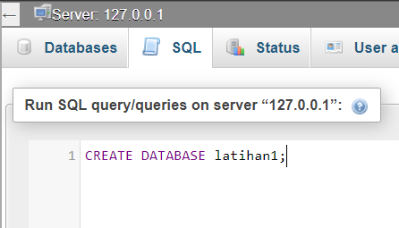
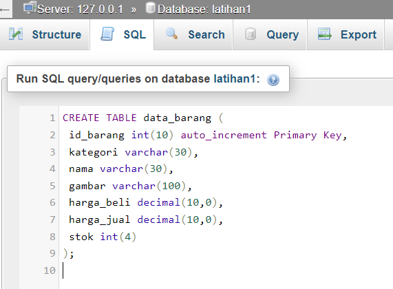
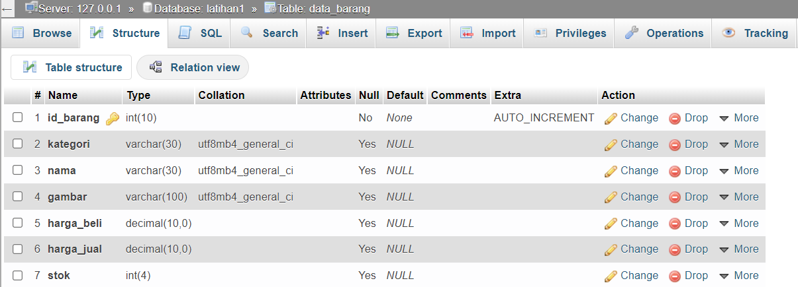
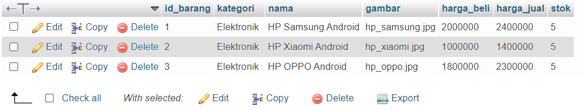
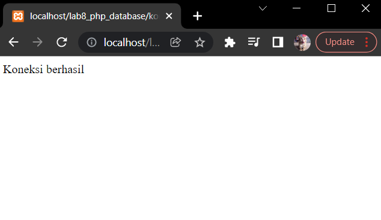
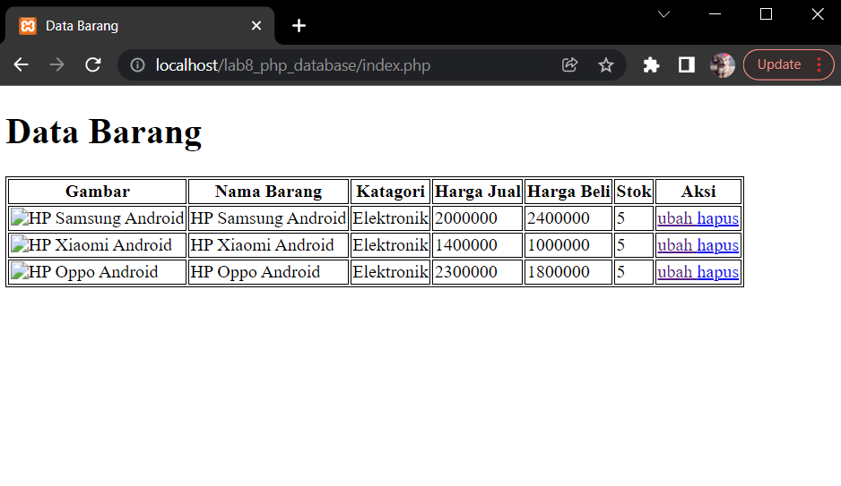
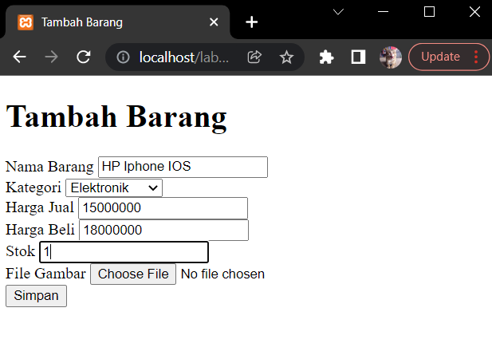
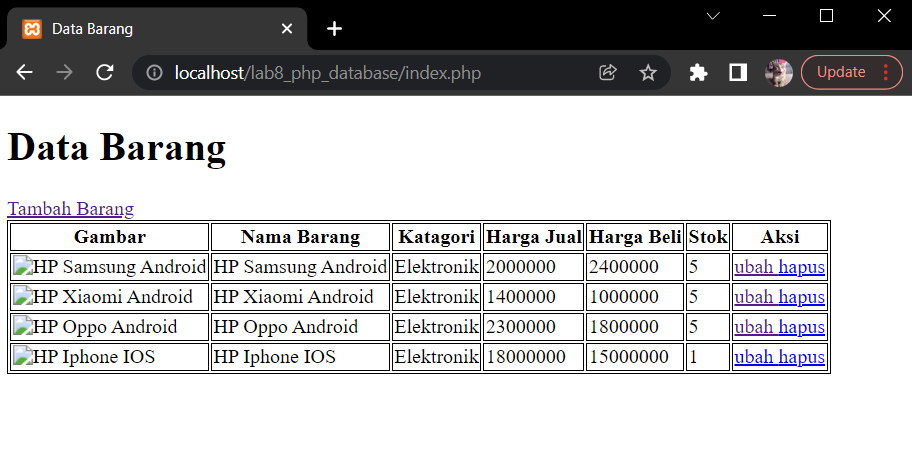

# :rocket: Latihan CRUD Sederhana

Made With : [](https://www.google.com/intl/id_id/chrome/) [](https://code.visualstudio.com/) [](https://www.php.net/)

- Nama : Hizbullah Ridwan
- NIM : 312110055
- Kelas : TI.21.B.1
- Mata Kuliah : Pemrograman Web

Daftar isi :

- [Run MYSQL Server](https://github.com/Ridwanwildan/Lab8Web#run-mysql-server)
- [Go To PHPMyAdmin](https://github.com/Ridwanwildan/Lab8Web#go-to-phpmyadmin)
- [Initialization in Root Directory](https://github.com/Ridwanwildan/Lab8Web#initialization-in-root-directory)
- [Hello World](https://github.com/Ridwanwildan/Lab7Web#hello-world)
- [Variable](https://github.com/Ridwanwildan/Lab7Web#variable)
- [Predefine Variable GET](https://github.com/Ridwanwildan/Lab7Web#predefine-variable-get)
- [Create Form Input](https://github.com/Ridwanwildan/Lab7Web#create-form-input)
- [Operator](https://github.com/Ridwanwildan/Lab7Web#operator)
- [Conditional](https://github.com/Ridwanwildan/Lab7Web#conditional)
- [Loop](https://github.com/Ridwanwildan/Lab7Web#loop)
- [Tugas](https://github.com/Ridwanwildan/Lab7Web#tugas)

## Run MYSQL Server

Pertama adalah melakukan running pada MYSQL server. Caranya adalah buka [XAMPP](https://www.apachefriends.org/) control kemudian pilih start pada `apache` dan `MySQL`. Kemudian untuk memastikan bahwa MYSQL server sudah running, akses ke `http://localhost` atau `http://127.0.0.1` pada browser.


## Go To PHPMyAdmin

Setelah pertama sudah berhasil running MYSQL server, selanjutnya adalah mengakses PHPMyAdmin di `http://localhost/phpmyadmin`. Akan terlihat menu utama dari PHPMyAdmin dan beberapa database yang sudah ada pada komputer.

### Create Database

Kemudian buat database baru menggunakan query dengan nama `latihan1`. Seperti ini :

```bash
CREATE DATABASE latihan1;
```



### Create Table

Pada latihan kali ini, Studi kasusnya adalah Data Barang. Maka buatlah tabel dengan nama `data_barang` dan dengan query seperti ini :

```bash
CREATE TABLE data_barang (
 id_barang int(10) auto_increment Primary Key,
 kategori varchar(30),
 nama varchar(30),
 gambar varchar(100),
 harga_beli decimal(10,0),
 harga_jual decimal(10,0),
 stok int(4)
);
```



Klik Go dan hasilnya bisa dilihat pada table structure.



### Add Data

Setelah tabel berhasil dibuat maka tabel tersebut masih kosong. Isi tabelnya dengan query seperti ini :

```bash
INSERT INTO data_barang (kategori, nama, gambar, harga_beli, harga_jual, stok)
VALUES ('Elektronik', 'HP Samsung Android', 'hp_samsung.jpg', 2000000, 2400000, 5),
('Elektronik', 'HP Xiaomi Android', 'hp_xiaomi.jpg', 1000000, 1400000, 5),
('Elektronik', 'HP OPPO Android', 'hp_oppo.jpg', 1800000, 2300000, 5);
```

Hasilnya bisa dilihat di menu `browse`.



## Initialization in Root Directory

Selanjutnya adalah melakukan beberapa inisialisasi seperti membuat file dan folder pada root directory web server. Secara default, root directory web server letaknya ada di `C:\xampp\htdocs`.

### Create Folder

Buat sebuah folder didalam root directory dengan nama `lab8_php_database`. Setelah itu akses `http://localhost/lab8_php_database` dan terlihat bahwa directory tersebut belum memiliki file sama sekali.

### Create Connection File

Buat sebuah file PHP dengan nama `koneksi.php` didalam directory `lab8_php_database`. File ini berfungsi untuk menghubungkan database yang sudah dibuat sebelumnya. Seperti ini :

```bash
<?php
    $host = "localhost";
    $user = "root";
    $pass = "";
    $db = "latihan1";
    $conn = mysqli_connect($host, $user, $pass, $db);
    if ($conn == false)
        {
        echo "Koneksi ke server gagal.";
        die();
        }
    else
        echo "Koneksi berhasil";
?>
```

Setelah selesai dibuat, coba buka file tersebut dan hasilnya akan seperti ini. Dan jika sudah berhasil, maka `else echo "koneksi berhasil";` bisa diubah menjadi komentar supaya tidak mengganggu tampilan utamanya nanti.



## Build CRUD

Sebelum CRUD bisa digunakan langsung pada website, CRUD perlu dibuat terlebih dahulu. Masing-masing dari Create, Read, update, dan Delete memiliki file PHP tersendiri.

### Read

Read menjadi menu tampilan utama pada saat membuka tampilan web. Maka file PHP dari read diberi nama `index.php`. Buat file `index.php` pada directory `lab8_php_database` dengan isi seperti ini :

```bash
<?php
    include("koneksi.php");
    // query untuk menampilkan data
    $sql = 'SELECT * FROM data_barang';
    $result = mysqli_query($conn, $sql);
?>
<!DOCTYPE html>
<html lang="en">
  <head>
    <meta charset="UTF-8" />
    <link href="style.css" rel="stylesheet" type="text/css" />
    <title>Data Barang</title>
  </head>
  <body>
    <div class="container">
      <h1>Data Barang</h1>
      <div class="main">
        <table>
          <tr>
            <th>Gambar</th>
            <th>Nama Barang</th>
            <th>Katagori</th>
            <th>Harga Jual</th>
            <th>Harga Beli</th>
            <th>Stok</th>
            <th>Aksi</th>
          </tr>
          <?php if($result): ?>
          <?php while($row = mysqli_fetch_array($result)): ?>
          <tr>
            <td>
              "
                alt="<?=$row['nama'];?>"
              />
            </td>
            <td><?= $row['nama'];?></td>
            <td><?= $row['kategori'];?></td>
            <td><?= $row['harga_beli'];?></td>
            <td><?= $row['harga_jual'];?></td>
            <td><?= $row['stok'];?></td>
            <td><?= $row['id_barang'];?></td>
          </tr>
          <?php endwhile; else: ?>
          <tr>
            <td colspan="7">Belum ada data</td>
          </tr>
          <?php endif; ?>
        </table>
      </div>
    </div>
  </body>
</html>
```

Selanjutnya adalah menambahkan CSS file yang fungsinya untuk menambahkan garis border. Seperti ini :

```bash
table, th, tr, td {
    border-style:solid;
    border-width:1px;
    border-color:#000000;
}
```



### Create

Selanjutnya adalah membuat file baru dengan nama `tambah.php` yang fungsinya adalah untuk menambahkan data baru kedalam database. Seperti ini :

```bash
<?php
    error_reporting(E_ALL);
    include_once 'koneksi.php';
    if (isset($_POST['submit']))
    {
        $nama = $_POST['nama'];
        $kategori = $_POST['kategori'];
        $harga_jual = $_POST['harga_jual'];
        $harga_beli = $_POST['harga_beli'];
        $stok = $_POST['stok'];
        $file_gambar = $_FILES['file_gambar'];
        $gambar = null;
        if ($file_gambar['error'] == 0)
        {
            $filename = str_replace(' ', '_',$file_gambar['name']);
            $destination = dirname(__FILE__) .'/gambar/' . $filename;
            if(move_uploaded_file($file_gambar['tmp_name'], $destination))
            {
                $gambar = 'gambar/' . $filename;;
            }
        }
        $sql = 'INSERT INTO data_barang (nama, kategori,harga_jual, harga_beli,
        stok, gambar) ';
        $sql .= "VALUE ('{$nama}', '{$kategori}','{$harga_jual}',
        '{$harga_beli}', '{$stok}', '{$gambar}')";
        $result = mysqli_query($conn, $sql);
        header('location: index.php');
    }
?>
<!DOCTYPE html>
<html lang="en">
  <head>
    <meta charset="UTF-8" />
    <link href="style.css" rel="stylesheet" type="text/css" />
    <title>Tambah Barang</title>
  </head>
  <body>
    <div class="container">
      <h1>Tambah Barang</h1>
      <div class="main">
        <form method="post" action="tambah.php" enctype="multipart/form-data">
          <div class="input">
            <label>Nama Barang</label>
            <input type="text" name="nama" />
          </div>
          <div class="input">
            <label>Kategori</label>
            <select name="kategori">
              <option value="Komputer">Komputer</option>
              <option value="Elektronik">Elektronik</option>
              <option value="Hand Phone">Hand Phone</option>
            </select>
          </div>
          <div class="input">
            <label>Harga Jual</label>
            <input type="text" name="harga_jual" />
          </div>
          <div class="input">
            <label>Harga Beli</label>
            <input type="text" name="harga_beli" />
          </div>
          <div class="input">
            <label>Stok</label>
            <input type="text" name="stok" />
          </div>
          <div class="input">
            <label>File Gambar</label>
            <input type="file" name="file_gambar" />
          </div>
          <div class="submit">
            <input type="submit" name="submit" value="Simpan" />
          </div>
        </form>
      </div>
    </div>
  </body>
</html>
```



`tambah.php` belum bisa diakses secara langsung dari index. Maka tambahkan terlebih dahulu link di `index.php` yang mengarah ke `tambah.php` supaya bisa melakukan aktifitas create.

```bash
<a href="tambah.php">Tambah Barang</a>
```

### Update

Update adalah melakukan penggantian value seperti mengganti nama, harga, stok dan lainnya. Buat file PHP baru dengan nama `ubah.php` dan isinya seperti ini :

```bash
<?php
    error_reporting(E_ALL);
    include_once 'koneksi.php';
    if (isset($_POST['submit']))
    {
        $id = $_POST['id'];
        $nama = $_POST['nama'];
        $kategori = $_POST['kategori'];
        $harga_jual = $_POST['harga_jual'];
        $harga_beli = $_POST['harga_beli'];
        $stok = $_POST['stok'];
        $file_gambar = $_FILES['file_gambar'];
        $gambar = null;

        if ($file_gambar['error'] == 0)
        {
            $filename = str_replace(' ', '_', $file_gambar['name']);
            $destination = dirname(__FILE__) . '/gambar/' . $filename;
            if (move_uploaded_file($file_gambar['tmp_name'], $destination))
            {
                $gambar = 'gambar/' . $filename;;
            }
        }
        $sql = 'UPDATE data_barang SET ';
        $sql .= "nama = '{$nama}', kategori = '{$kategori}', ";
        $sql .= "harga_jual = '{$harga_jual}', harga_beli = '{$harga_beli}', stok
        = '{$stok}' ";
        if (!empty($gambar))
            $sql .= ", gambar = '{$gambar}' ";
        $sql .= "WHERE id_barang = '{$id}'";
        $result = mysqli_query($conn, $sql);
        header('location: index.php');
    }
    $id = $_GET['id'];
    $sql = "SELECT * FROM data_barang WHERE id_barang = '{$id}'";
    $result = mysqli_query($conn, $sql);
    if (!$result) die('Error: Data tidak tersedia');
    $data = mysqli_fetch_array($result);

    function is_select($var, $val) {
        if ($var == $val) return 'selected="selected"';
        return false;
    }
?>
<!DOCTYPE html>
<html lang="en">
    <head>
        <meta charset="UTF-8">
        <link href="style.css" rel="stylesheet" type="text/css" />
        <title>Ubah Barang</title>
    </head>
    <body>
        <div class="container">
            <h1>Ubah Barang</h1>
            <div class="main">
                <form method="post" action="ubah.php" enctype="multipart/form-data">
                    <div class="input">
                        <label>Nama Barang</label>
                        <input type="text" name="nama" value="<?php echo $data['nama'];?>" />
                    </div>
                    <div class="input">
                        <label>Kategori</label>
                        <select name="kategori">
                            <option <?php echo is_select
                            ('Komputer', $data['kategori']);?> value="Komputer">Komputer</option>
                            <option <?php echo is_select
                            ('Komputer', $data['kategori']);?> value="Elektronik">Elektronik</option>
                            <option <?php echo is_select
                            ('Komputer', $data['kategori']);?> value="Hand Phone">Hand Phone</option>
                        </select>
                    </div>
                    <div class="input">
                        <label>Harga Jual</label>
                        <input type="text" name="harga_jual" value="<?php echo $data['harga_jual'];?>" />
                    </div>
                    <div class="input">
                        <label>Harga Beli</label>
                        <input type="text" name="harga_beli" value="<?php echo $data['harga_beli'];?>" />
                    </div>
                    <div class="input">
                        <label>Stok</label>
                        <input type="text" name="stok" value="<?php echo $data['stok'];?>" />
                    </div>
                    <div class="input">
                        <label>File Gambar</label>
                        <input type="file" name="file_gambar" />
                    </div>
                    <div class="submit">
                        <input type="hidden" name="id" value="<?php echo
                        $data['id_barang'];?>" />
                        <input type="submit" name="submit" value="Simpan" />
                    </div>
                </form>
            </div>
        </div>
    </body>
</html>
```



### Delete

Buat file PHP baru dengan nama `hapus.php` yang fungsinya untuk menghapus data. `hapus.php` tidak memiliki tampilan depan seperti yang lain, tetapi hanya query untuk menghapus data sesuai `id` saja.

```bash
<?php
    include_once 'koneksi.php';
    $id = $_GET['id'];
    $sql = "DELETE FROM data_barang WHERE id_barang = '{$id}'";
    $result = mysqli_query($conn, $sql);
    header('location: index.php');
?>
```
