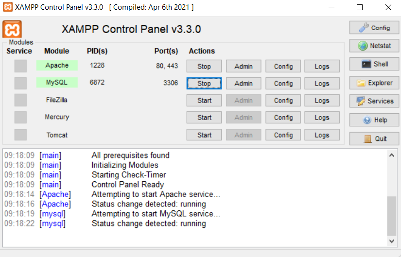

# :rocket: Latihan CRUD Sederhana

Made With :   

- Nama : Hizbullah Ridwan
- NIM : 312110055
- Kelas : TI.21.B.1
- Mata Kuliah : Pemrograman Web

Daftar isi :

- [Run MYSQL Server](https://github.com/Ridwanwildan/Lab8Web#run-mysql-server)
- [Run Web Server](https://github.com/Ridwanwildan/Lab7Web#run-web-server)
- [Create Folder and File](https://github.com/Ridwanwildan/Lab7Web#create-folder-and-file)
- [Hello World](https://github.com/Ridwanwildan/Lab7Web#hello-world)
- [Variable](https://github.com/Ridwanwildan/Lab7Web#variable)
- [Predefine Variable GET](https://github.com/Ridwanwildan/Lab7Web#predefine-variable-get)
- [Create Form Input](https://github.com/Ridwanwildan/Lab7Web#create-form-input)
- [Operator](https://github.com/Ridwanwildan/Lab7Web#operator)
- [Conditional](https://github.com/Ridwanwildan/Lab7Web#conditional)
- [Loop](https://github.com/Ridwanwildan/Lab7Web#loop)
- [Tugas](https://github.com/Ridwanwildan/Lab7Web#tugas)

## Run MYSQL Server

Pertama adalah melakukan running pada MYSQL server. Caranya adalah buka [XAMPP](https://www.apachefriends.org/) control kemudian pilih start pada `apache` dan `MySQL`. Kemudian untuk memastikan bahwa MYSQL server sudah running, akses ke `http://localhost` atau `http://127.0.0.1` pada browser.

##
